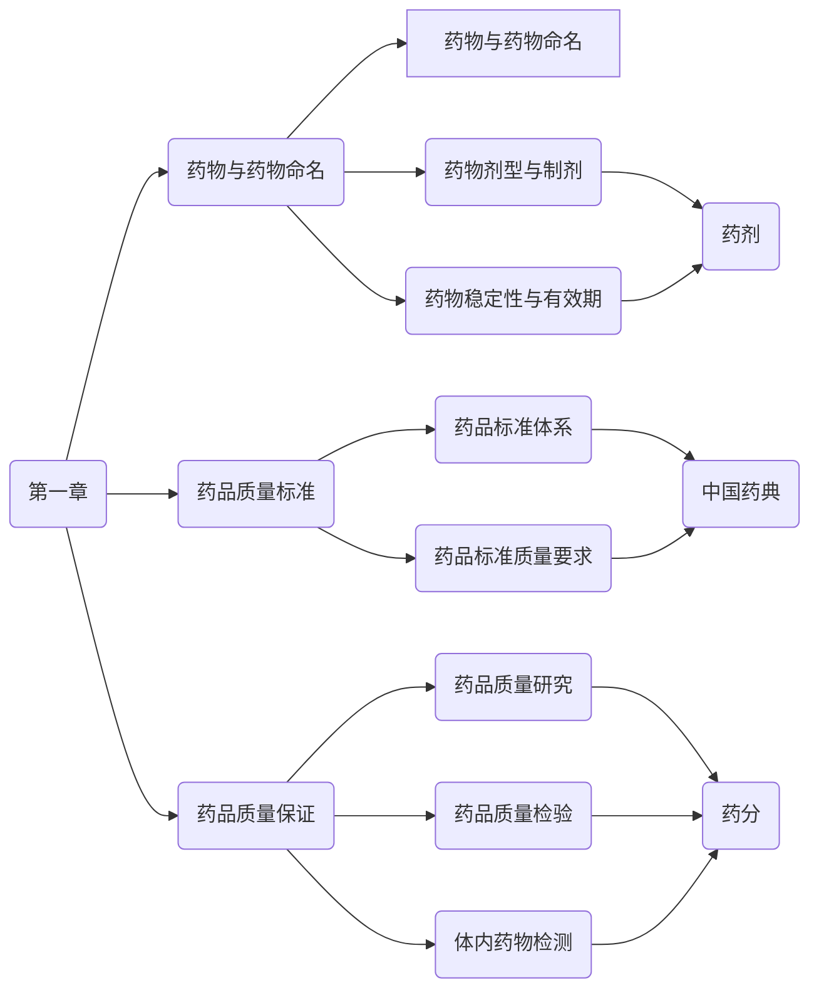
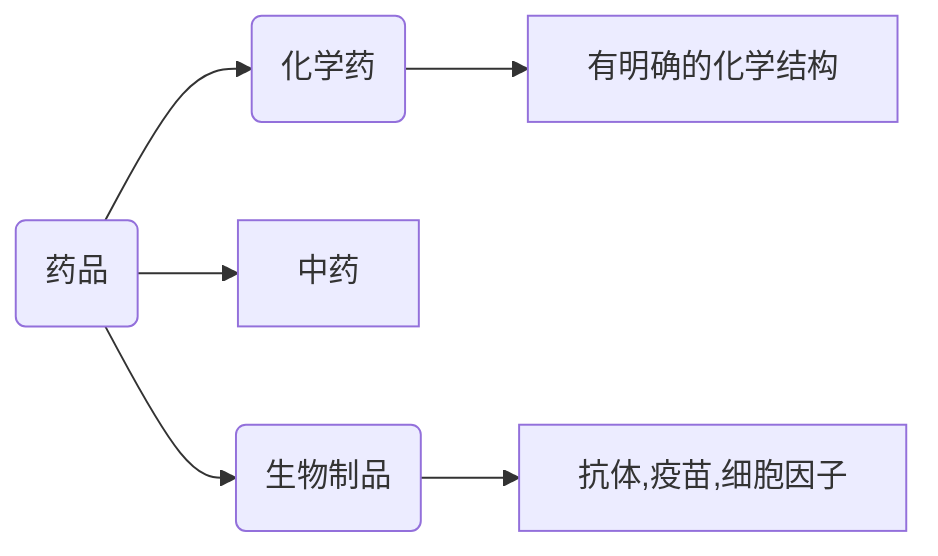
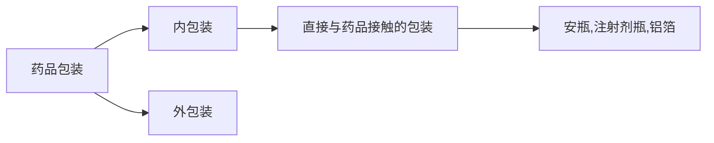
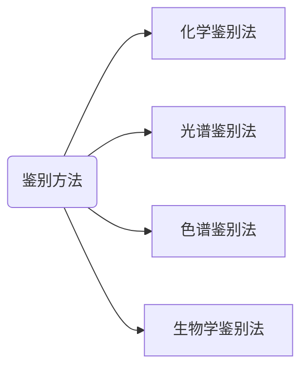

#导学
##考试科目：

 考试科目|考试范围
 -|-
 药学专业知识（一）| 药剂学、药物化学、药物分析、药理学总论
 药学专业知识（二）|临床药学
 药事管理与法规|药物的生产、流通、使用
 药学综合|临床用药

**药学专业知识（二）核心：首选、机制、分类、不良反应（ADR）**
##药品经营质量管理规范——色标管理（三色六区）
红色：不合格药品
黄色：待验药品区、退货药品区
绿色：合格药品区、待发药品区、零售称取区
##处方印刷纸颜色区别：
淡黄色：急诊处方
淡绿色：儿科处方
淡红色：麻醉、精神类药品处方
白色：普通处方
##普通药物处方用量：<=7日常用量

多选题：至少两个答案
#药学专业知识（一）
##教材变动
###==对映异构体之间：越来越不和睦==（逢新必考）
六种情况
1. 对映异构体之间具有等同的药理活性和强度
2. 对映异构体之间药理活性相同，但强弱不同
3. 对映异构体中一个有活性，一个没有活性
4. 对映异构体之间产生相反的药理活性
5. 对映异构体之间产生不同类型的药理活性
6. 一个对映异构体具有药理活性，另一个对映体具有毒性作用
e.g.哌西那朵、扎考必利、依托唑啉、异丙肾上腺素
口诀：依扎、哌异活性反
(+)-哌西那朵（==右旋哌西那朵==）是阿片受体激动剂
(-)-哌西那朵是阿片受体阻断药
但由于右旋哌西那朵具有更强的作用，其外消旋体表现为部分激动作用
###第三章 二十多分（变化不大）
###第四章 药剂学（纯记忆）
####可口服的非离子行表面活性剂：
脂肪酸山梨坦（司盘）、聚山梨酯（吐温）、蔗糖脂肪酸酯、聚氧乙烯脂肪酸酯（卖泽）、聚氧乙烯脂肪醇醚类（苄泽）、聚氧乙烯-聚氧丙烯共聚物（泊洛沙姆）。

---
###第五章 注射剂
####注射剂使用注意事项：
1. 要临用前配制且应注意pH对注射剂稳定性的影响。当其他给药途径能达到治疗效果时尽量不要注射给药。
2. 尽可能减少注射次数，采用序贯疗法（即紧急情况下先用注射剂，病情控制后马上改为口服给药）。
3. 能够肌内注射的就不静脉注射。
4. 严格掌握注射剂的剂量和疗程
###第七章 药物动力学
####影响胃排空速率的因素：
1. 稀的软体食物较稠的或固体食物的胃排空快。胃排空时间：糖类<蛋白质<脂肪，混合食物由胃全部排空通常需要4~6小时。
2. 随着胃部内容物的黏度和渗透压增高，胃排空速率减小，胃内滞留时间延长。
3. 服药时饮用大量水，也可促进胃排空而有利于药物吸收：因为增加饮水量，胃内容物体积增大和渗透压降低，加快胃排空速率，进入小肠后药物的稀溶液可与肠壁充分接触，也有利于药物的吸收。
4. 药物因素：溴丙胺太林、吗啡、阿司匹林、异丙肾上腺素等能减小胃排空速率；普萘洛尔能增加胃排空速率。

---
####药物对心血管系统的毒性作用
亚硝酸盐和羟基自由基被认为毒性最大，此外还有活性氧和多柔比星。

---
#药学专业知识（一）
##第一章 药物与药物制剂

###第一节 药物与药物制剂
####一、药物与药物命名
#####（一）药物的来源于分类

####二、制剂和剂型的概念
**剂型**指适用于疾病的诊断、治疗或预防的需要而制备的不同给药==形式==。
**制剂**指将原料药物按照某种剂型制成一定规格并具有一定质量标准的具体==品种==。
剂型——形式
制剂——品种
药物通用名+剂型名=制剂名
#####（三）药物剂型的重要性
1. 可改变药物的作用性质———==硫酸镁口服是泻药；静脉滴注是镇静、解痉；依沙吖嘧啶注射是引产；涂敷是杀菌==
2. 可调节药物作用速度
3. 可降低（或消除）药物的不良反应
4. 可产生靶向作用
5. 可提高药物的稳定性
6. 可影响疗效（==不能提高，与辅料作用区别==）
#####(四)药用辅料——最低用量原则
1. 赋形
2. 制备顺利进行
3. 提高稳定性
4. 提高药物疗效
5. 降低药物不良反应
6. 调节药物作用
7. 提高药物顺应性
#####（五）药品的包装材料
1. 药品包装的含义

2. 药品包装材料的分类
塑料（一类）、玻璃（二类）、金属（三类）
3. 常用药品包装材料——玻璃、塑料、金属、复合材料
（1）玻璃材料——怕水怕碱不怕酸
浓酸对玻璃的侵蚀能力低于弱酸
（2）塑料
1）特点——==不易再生==、造成环境污染

材料|缩写|特点
-|-|-
聚丙烯|PP|==塑料中最轻；可作为高温消毒灭菌材料==
聚氯乙烯|PVC|无毒，但氯乙烯单体有致肝癌作用，耐热性差;==铝塑料泡罩包装的泡罩材料==
聚偏二氯乙烯|PVDC|==阻隔性极佳；价格昂贵==
聚酯|PET|==韧性最大==
聚乙烯|PE| 
高密度聚乙烯|HDPE|硬、韧、透明性较低
中密度聚乙烯|MDPE| 
低密度聚乙烯|LDPE|柔软、透明、阻隔差
线性低密度聚乙烯|LLDPE|韧度好、阻隔好、厚度低、热封性好

（3）金属
1. 镀锡薄钢板
2. 铝箔——==极富延展性==/不可热封/任何细菌和微生物都不能在其表面生长
（4）复合材料
回收性差（含有塑料）
###第二节 药品质量标准
####一、药品标准体系
药典、药品注册标准、企业药品标准
《中国药典》内容：凡例、正文、通则
不包含：不良反应、药代动力学、功效
####二、药品标准质量要求
（一）《中国药典》标准体系
凡例、通则、正文
（二）《中国药典》基本要求
**1.性状**
（1）外观性状
（2）溶解度
易溶——溶质 1g(mL)能在溶剂1~不到10mL中溶解
溶解——溶质 1g(mL)能在溶剂10~不到30mL中溶解
微溶——溶质 1g(mL)能在溶剂100~不到1000mL中溶解
几乎不溶或不溶——溶质 1g(mL)在溶剂10000mL中不能溶解
（3）物理常数
**2.鉴别**——判断真伪

光谱法：紫外分光光度法、红外分光光度法
**3.检查**
化学药品检查分类：
限量检查法——评价纯度（针对杂质的检查）
特性检查法——评价药物的有效性和均一性
生物学检查法——针对灭菌制剂评价安全性
一、限量检查法：
（1）一般杂质检查法：
氯化物+硝酸银——浑浊
铅等金属+硫代乙酰胺——显色
砷盐+古蔡氏法/二乙基二硫代氨基甲酸银
水分——费休氏法
（2）特定杂质检查法
1）特定杂质（规定工艺生产过程中产生的杂质）
阿司匹林-游离水杨酸；对乙酰氨基酚-对氯苯乙酰胺；盐酸普鲁卡因-对氨基苯甲酸；异烟肼-游离肼；硫酸阿托品-莨菪碱；青霉素钠-青霉素聚合物；肾上腺素-酮体
2）非特定杂质（贮藏过程中可能因不同条件发生降解产生）
二、特性检查法
1. 崩解时限检查法
2. 溶出度与释放度检查法
3. 含量均匀度检查法
4. 结晶性检查法
含量均匀度检查
（1）单剂量标示量<25mg
（2）主药含量<单剂量中量25%者
（3）采用混合工艺制程的注射用无菌粉末
（4）内充非均相溶液的软胶囊
（5）单剂量包装的口服混悬液、透皮贴剂、栓剂
检查了含量均匀度，一般不再进行重量差异检查
**4.含量或效价测定**
标准物质：具有确定特性量值，用于校准设备。评价测量方法、给供试药品赋值或鉴别用的物质
共有五类：标准品、对照品、对照药材、对照提取物、参考品
标准品：用于生物检定或效价测定的标准物质，按照==效价==单位计——生物药品
对照品：用于鉴别、检查、含量测定的标准物质，按==纯度计==——化学药品
**5.附加事项**
（1）规格
==制剂的标示量，系指每一支、片或其他每一单位制剂中含有主药的重量(或效价)或含量（%）或装量。==
（2）贮藏
避光：避免日光
遮光：不透光容器包装
温度
阴凉处：==贮藏温度不超过20°C==
凉暗处:==贮藏处避光且温度不超过20°C==
冷处：==贮藏处温度为2°C~10°C；==
==生物制品：2°C~8°C==
常温：==温度为10°C~30°C==
###第三节 药品质量保证
4.药品稳定性实验指导原则
（1）影响因素实验：==高温、高湿、强光的剧烈条件==
高温——温度==高于加速试验10°C以上，60°C+-2°C==
高湿——相对湿度==90%+-5%==
强光照射——照度为==4500Lx==+-500Lx
(2)加速试验：在较短时间内预测产品在常温条件下的质量稳定情况
检查时间点：0，3，6个月
（3）长期试验：接近实际贮藏条件下贮藏
（二）体内样品的测定法：
免疫分析法
色谱分析法
（二）仿制药质量一致性评价
包括：安全性+有效性
安全性评价指标——药物杂质谱
有效性评价指标——人体生物等效性
二、药品质量检查
三、体内药品检测
（一）生物样品的种类
血样、尿液、唾液、活体组织
血样包括：全血、血浆、血清

血样|处理方式|占比
-|-|-
全血|+抗凝剂|100%
血浆|全血+抗凝剂-->离心-->上清液|占全血量50%~60%
血清|全血-->离心-->上清液|占全血量20%~40%

抗凝剂：肝素、EDTA、草酸盐、构橼酸盐等
（二）体内样品的测定方法：免疫分析法（灵敏度高，用于临床）和色谱分析法（专属性好，用于复杂样品）
##第四章口服制剂与临床应用
###第一节 固体制剂
####一、口服固体制剂的常用辅料
1.片剂填充剂（口诀：填充淀可糖糊乳，微晶无机盐甘露）——淀粉、可压性淀粉、糖粉、糊精、乳糖、微晶纤维素、无机盐、甘露醇
2.片剂黏合剂（口诀：黏合馏水乙淀浆，羧甲乙基羟丙甲）——蒸馏水、乙醇、淀粉浆、羧甲基纤维素钠、乙基纤维素、羟丙基纤维素、羟丙基甲基纤维素。PVP(聚维酮)、PEG(聚乙二醇)、明胶
3.片剂崩解剂（口诀：崩解羧甲干淀照，低羟交联交聚泡）——羧甲基淀粉钠、干淀粉、低取代羟丙基纤维素、交联羧甲基纤维素钠、交联聚维酮、泡腾崩解剂。
4.片剂润滑剂（口诀：润滑硬脂滑硅胶，聚乙植物月桂调）——硬脂酸镁、滑石粉、微粉硅胶、聚乙二醇、氢化植物油、月桂醇硫酸钠。
5.释放调节剂
（1）骨架型缓释剂
1）亲水性凝胶骨架材料：羧甲基纤维素钠、甲基纤维素、羟丙甲纤维素、聚维酮卡波姆、海藻酸盐、脱乙酰壳多糖（壳聚糖）。(记忆：海波，三个甲壳)
2）不溶性骨架材料：聚甲基丙烯酸酯、乙基纤维素（EC）、聚乙烯、无毒聚氯乙烯、乙烯-醋酸乙烯共聚物、硅橡胶。
3）生物溶蚀性骨架材料：动物脂肪、蜂蜡、巴西棕榈蜡、氢化植物油、==硬脂醇==、单硬脂酸甘油酯。
（2）包衣膜型缓释材料
1）不溶高分子材料：乙基纤维素(EC）
2）肠溶性高分子材料：丙烯酸树脂L和S型、醋酸纤维素==酞酸酯==（CAP）、醋酸羧丙甲纤维素琥珀酸酯（HPMCAS）、羟丙基甲基纤维素酞酸酯（HPMCP）
####二、口服固体制剂包衣
胃溶型：羟丙基甲基纤维素、羟丙基纤维素、丙烯酸树脂四号、聚乙烯缩乙醛二乙氨乙酸
不溶型：醋酸纤维素、乙基纤维素
肠溶型：醋酸纤维素酞酸酯、羟丙基甲基纤维素酞酸酯、虫胶、丙烯酸树脂一、二、三号
（口诀：胃溶羟丙甲四聚，不溶醋酸乙基叙，肠溶醋丙酞虫一二三）
增塑剂：水溶性（丙二醇、甘油、聚乙二醇）+非水溶性（甘油三醋酸酯、乙酰化甘油酸酯、邻苯二甲酸酯）
释放调节剂（即致孔剂）：蔗糖、氯化钠、表面活性剂和PEG等
遮光剂：二氧化钛
####三、散剂和颗粒剂
（一）散剂
1.特点
(1)一般为细粉，粒径小、比表面积大、易分散、起效快；
==对光、湿、热敏感的药物一般不制成散剂；==
（2）制备工艺简单，剂量易于控制，便于特殊群体如婴幼儿与老人服用；
（3）包装、贮存、运输及携带方便
（4）==对于中药散剂，包含各种粗纤维和不能溶于水的成分，完整保存了药材的药性。==
2.质量要求
口服：细粉
毒、贵、剂量小：配研法
多剂量散：附分剂量的用具
含毒口服：单剂量包装
散剂中可含可不含辅料
贮存：密闭、密封（挥发、易吸潮）
==含水量不得超过9.0%
干燥失重量不得超过2.0%。==
3.口服散剂的临床应用与注意事项
内服散剂：细粉；过80~100木筛；不宜大量饮水，服用后半小时内不可进食，温胃止痛的散剂不需温水送服
（二）颗粒剂质量要求
1.颗粒剂的特点
2.颗粒制剂质量要求
（1）==颗粒剂一般不能通过一号筛与能通过五号筛的总和不得超过15%==
（2）==中药颗粒剂中一般水分含量不得过8%==
（3）干燥失重不得超过2%
（4）==混悬颗粒以及已规定检查溶出度或释放度的颗粒剂可不进行溶化性检查==；可溶性颗粒剂应==全部溶化或轻微浑浊==
溶化性/崩解时限：看不见了
溶出度/释放度：变为分子或离子状态
泡腾颗粒剂溶化性：5分钟内
中药颗粒剂不得有==焦屑==
颗粒剂质检项目：==粒度、水分、干燥失重、溶出度/释放度、溶化性、含量均匀度==
3.颗粒剂的临床应用与注意事项
1）适用于老年、儿童、吞咽困难者
2）==普通颗粒剂冲服时应使药物完全溶解；肠溶、缓释、控释服用时应保证释药结构的完整性==
3）==可溶、泡腾：温水送服，忌放口中用水送服==
4）==混悬：不溶部分一并服用==
5）==中药颗粒剂：忌铁器、铝器==
6）密封，干燥处贮存
####四、口服片剂
（一）片剂的特点
（二）片剂的分类
普通片、口服崩解片、分散片
（三）*片剂制备中的常见问题及原因*
裂片、松片、崩解迟缓、溶出超限、含量不均匀
小剂量药物更严重（测含量均匀度）
（四）片剂的质量要求、包装与贮存
1.质量要求
1）硬度：50N以上为宜(N表力的单位)
2）脆碎度小于1%
3）片重差异

片剂的平均重量（g）|片重差异限度（%）
-|-
<0.30|+-7.5
>=0.30|+-5.0

 4）外观
 5）崩解度或溶出度（上限）
 ==舌下片、泡腾片：5分钟
 普通片剂：15分钟
 薄膜衣片：30分钟；可溶片、分散片：3分钟
 肠溶衣片：盐酸溶液中2小时安全，在pH6~8磷酸盐缓冲液中1小时==
 （记忆：舌泡五分普一刻，三十薄膜三可分；六十最久肠溶片）
（五）片剂的临床应用与注意事项
（1）服用方法
可掰开：裂痕片、分散片
不可掰开：==糖衣片、包衣片和缓释、控释片、肠溶片、双层糖衣片
可分剂量服用的缓控释片通常外观有一分刻痕，服用时保持半片完整性==
（2）服药次数及时间
（3）服药溶剂：白开水
（4）服药姿势：站姿或坐姿
####五、胶囊剂
（一）分类（胶丸也是胶囊剂）
（二）特点
1.优点
2.局限性
（1）胶囊壳——明胶——娇气
（2）麻烦、成本高
（3）婴幼儿、老人不适用
（4）不适宜制备成胶囊剂
1）会导致胶囊壁溶化的水溶液和稀乙醇溶液药物
2）风化性（易失水）药物、吸湿性药物
3）醛类药物
4）挥发性、小分子有机物液体药物
5）O/W型乳剂药物（水包油型）
（三）胶囊剂的质量要求
1.质量要求
（1）外观
（2）==中药硬胶囊水分含量不得超过9%==
（3）装量差异

平均装量或标示装量|装量差异度
-|-
0.30g以下|+-10%
0.30g及0.30g以上|+-7.5%（中药+-10%）

（4）崩解时限
==硬胶囊——30分钟
软胶囊——60分钟==
